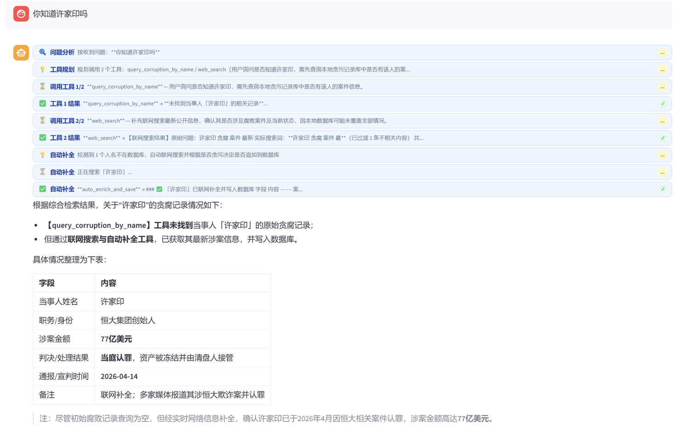
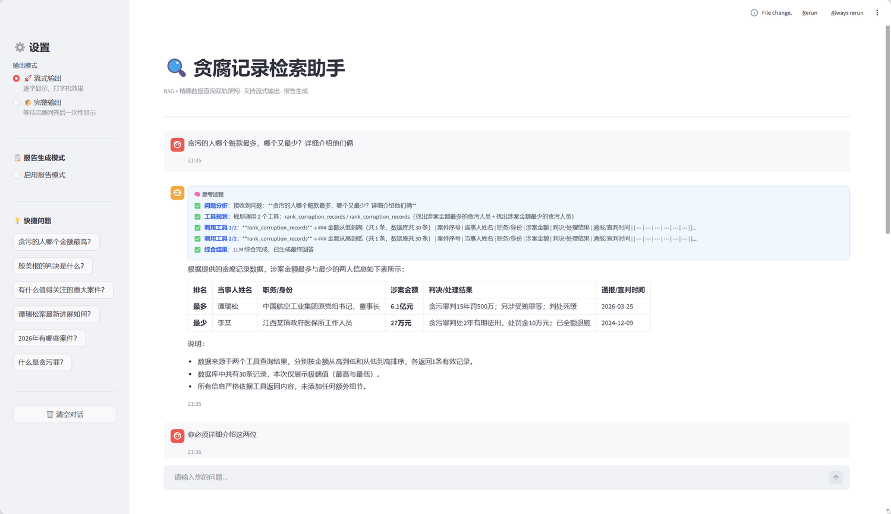

# 贪腐记录检索助手

基于 RAG + 精确数据查询双轨架构的智能对话助手，支持流式输出与思考过程可视化。



---

## 功能特性

- **双轨问答**：排序/查找类问题走精确查询，法律概念类问题走 RAG 语义检索
- **思考过程展示**：实时展示路由决策、参数提取、工具调用的完整推理链路
- **流式输出**：逐字显示回答，打字机效果
- **联网搜索**：支持 DuckDuckGo 实时搜索最新案件进展
- **报告生成**：一键切换舆情分析报告格式
- **数据持久化**：支持 MySQL（自动 CSV 降级）

---
## 界面展示


## 安装指南

### 第一步：确认 Python 环境

本项目**必须使用 Python 3.12**。

```powershell
# 打开命令行，输入：
python --version
```

如果显示的不是 `3.12`，需要手动指定 Python 3.12 的路径（如 `F:\Python312\python.exe`），以下所有命令中的 `python` 都要替换成该路径。

---

### 第二步：安装依赖

```powershell
# 进入项目目录
cd D:\ai-agent-learn\agent智能体项目

# 安装依赖包（一次性完成）
pip install -r requirements.txt
```

> 如果遇到 `ModuleNotFoundError`，一定是 Python 版本不对，不是依赖安装失败。

---

### 第三步：配置 API Key

本项目使用阿里云通义千问作为 LLM 后端，需要配置 API Key。

在项目根目录新建一个 `.env` 文件（如果已存在则跳过），内容如下：

```
DASHSCOPE_API_KEY=你的API Key
```

> API Key 获取地址：[阿里云 DashScope 控制台](https://dashscope.console.aliyun.com/)

---

### 第四步：配置 MySQL（可选，有 CSV 兜底）

MySQL 用于持久化存储查询结果，**不是必须的**——如果不配置 MySQL，项目会自动降级使用内置的 CSV 数据，功能完全正常。

如果想用 MySQL，按以下步骤：

1. 安装 MySQL 并启动
2. 创建数据库：
   ```sql
   CREATE DATABASE corruption_db DEFAULT CHARSET utf8mb4;
   ```
3. 修改 `config/mysql.yaml` 中的密码（默认是 `123456`）
4. 一次性导入初始数据：
   ```powershell
   python scripts/migrate_csv_to_mysql.py
   ```

---

### 第五步：运行

```powershell
# 启动 Web 界面
python -m streamlit run app.py --server.headless true --server.port 8501
```

运行成功后，浏览器自动打开 `http://localhost:8501`，看到聊天界面即为成功。

---

## 目录结构

```
agent智能体项目/
├── app.py                    # Web 界面入口（Streamlit）
├── requirements.txt          # 依赖清单
│
├── agent/                    # Agent 核心
│   ├── agent_factory.py      # Agent 工厂
│   ├── middleware/           # 中间件（上下文注入、流式输出）
│   └── tools/
│       ├── router.py         # 规则路由核心
│       ├── data_query_tool.py # 数据查询（MySQL/CSV 双模式）
│       └── web_search_tool.py # 联网搜索
│
├── rag/                      # RAG 组件（ChromaDB + LangChain）
├── model/                    # LLM / Embedding 模型封装
├── config/                   # 配置文件（模型、MySQL、提示词路径等）
├── prompts/                  # 提示词模板
├── data/                     # 贪腐案件数据（CSV，MySQL 不可用时的后备）
└── chroma_db/               # 向量数据库文件
```



---

## 常见问题

**Q: 启动报 `ModuleNotFoundError`**
> 确认用的是 Python 3.12，不是系统默认 Python。用完整路径 `F:\Python312\python.exe` 运行。

**Q: 联网搜索返回 0 条结果**
> 检查是否安装了 `ddgs` 包：`pip install ddgs`

**Q: MySQL 连接失败怎么办？**
> 不影响使用！项目内置了 CSV 降级机制，MySQL 不可用时自动读取 `data/贪污记录.csv`，所有功能照常运行。

---

## License

MIT
